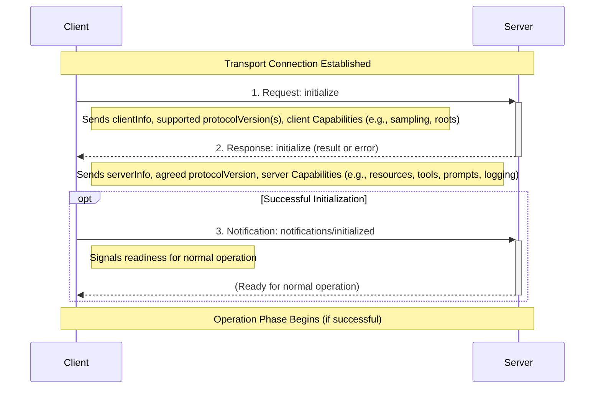
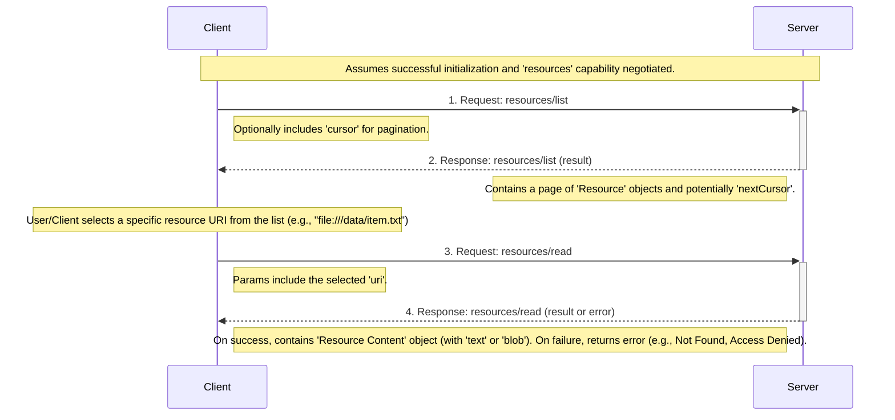
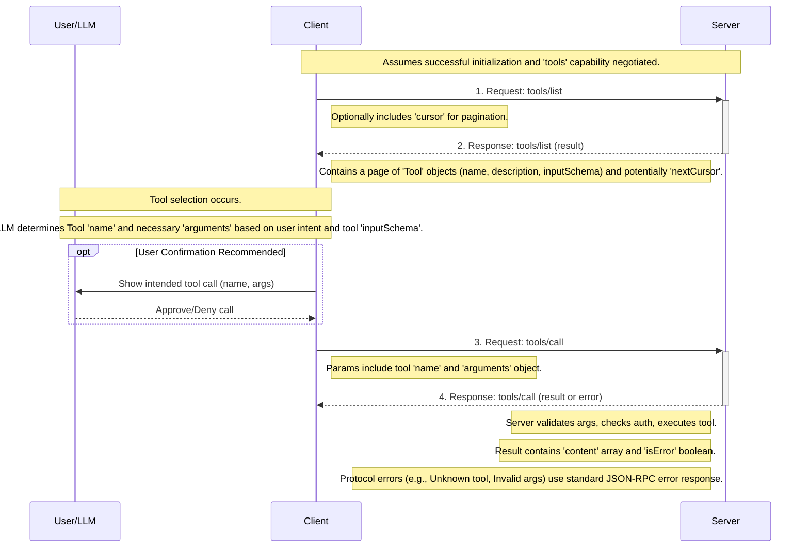
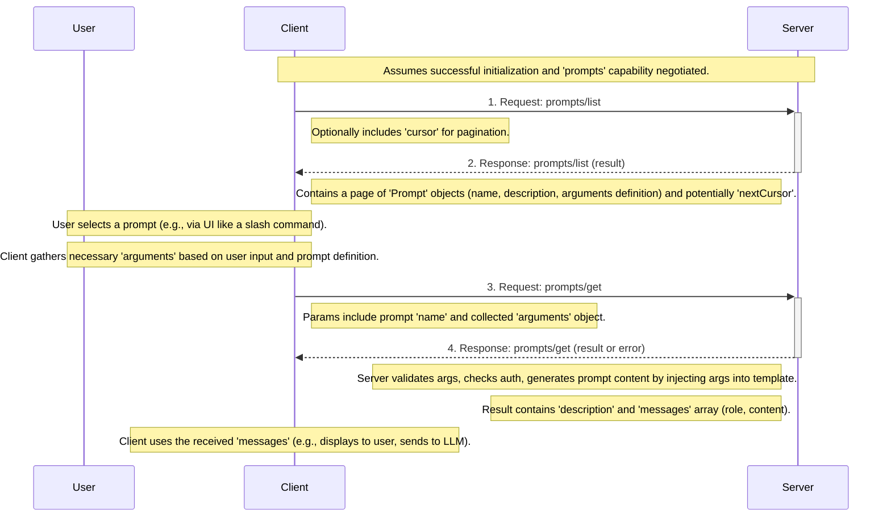
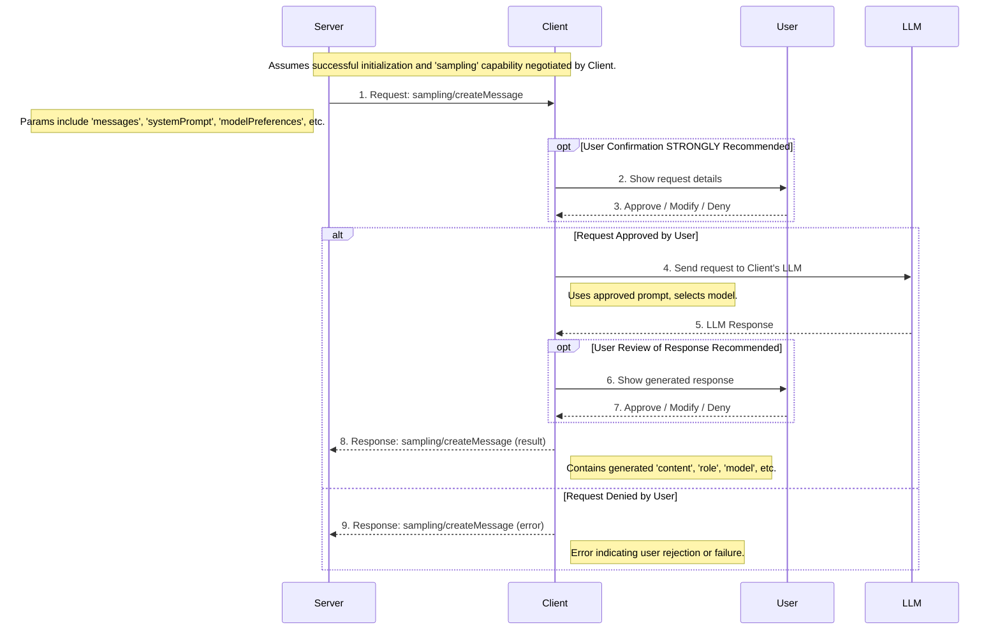
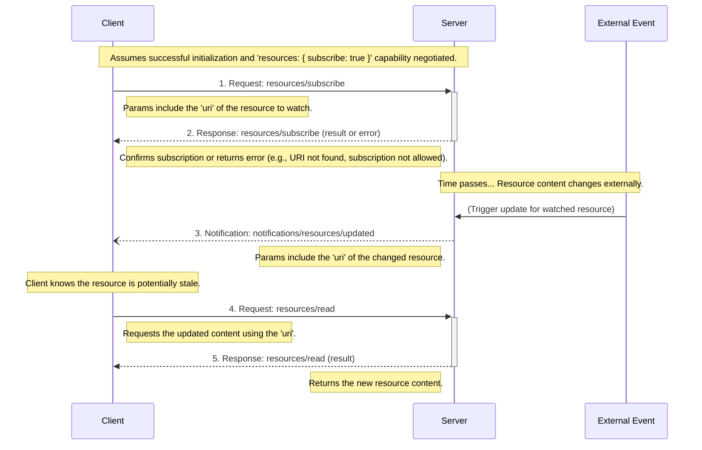

## 5. Communication Patterns & Data Flow

This section illustrates typical sequences of message exchanges for key MCP operations. These flows highlight how different protocol features interact.

### 5.1. Initialization & Capability Negotiation

This is the mandatory first step after establishing the underlying transport connection (e.g., TCP, WebSocket, stdio pipe).

**Flow Description:**

1.  **Client -> Server (`initialize` Request):** The client initiates the handshake, declaring its identity (`clientInfo`), the protocol version(s) it supports, and the capabilities it offers (e.g., `sampling`, `roots`).
2.  **Server -> Client (`initialize` Response):** The server responds with its identity (`serverInfo`), the protocol version it agrees to use for the session (based on mutual support), and the capabilities it offers (e.g., `resources`, `tools`). If initialization fails (e.g., version mismatch, critical error), it returns an error response.
3.  **Client -> Server (`notifications/initialized` Notification):** Upon receiving a successful `initialize` response, the client confirms it's ready to proceed with normal operations according to the negotiated capabilities and protocol version.

**Security Implications:** See [Section 3.2](./03-protocol-interactions.md#32-lifecycle-management-initialize-shutdown-exit) for detailed security considerations related to this phase (Capability Spoofing, Version Downgrade, Info Leakage, etc.). The integrity and validation of this initial exchange are critical for session security.

### 5.2. Resource Discovery & Reading

This pattern describes how a client finds available resources and retrieves the content of one.

**Flow Description:**

1.  **Client -> Server (`resources/list` Request):** The client requests a list of available resources. It may include a `cursor` obtained from a previous response to fetch subsequent pages.
2.  **Server -> Client (`resources/list` Response):** The server returns a list (potentially a page) of `Resource` objects it deems accessible/relevant to the client, potentially including a `nextCursor` if more results exist. Authorization checks should happen server-side before returning results.
3.  **Client -> Server (`resources/read` Request):** After identifying a desired resource (e.g., via user selection, application logic), the client requests its content using the resource's `uri`.
4.  **Server -> Client (`resources/read` Response):** The server performs access control checks for the requested `uri`. If authorized and the resource exists, it returns the `Resource Content` (containing the actual data as `text` or `blob`). Otherwise, it returns an appropriate JSON-RPC error.

**Security Implications:** See [Section 4.2](./04-data-structures.md#42-resources) for detailed considerations:
- Crucial server-side validation of URIs in `resources/read` to prevent path traversal.
- Access control enforcement *before* both listing and reading.
- Potential data leakage via metadata in `resources/list` results.
- Safe handling of received content (`text`/`blob`) by the client.
- Potential DoS via large resource requests or pagination abuse.

### 5.3. Tool Discovery & Execution

This pattern shows how a client discovers available tools and invokes one, often guided by an LLM or user interaction.

**Flow Description:**

1.  **Client -> Server (`tools/list` Request):** The client requests the list of tools offered by the server, potentially using pagination (`cursor`).
2.  **Server -> Client (`tools/list` Response):** The server returns a list of `Tool` objects, including their `name`, `description`, and crucially, the `inputSchema` defining required arguments.
3.  **(Client/LLM/User Interaction):** The client, potentially interacting with an LLM or the user, identifies the appropriate tool `name` to achieve a goal and gathers the required `arguments` matching the `inputSchema`.
4.  **(User Confirmation - Recommended):** Before executing a potentially impactful action, the client SHOULD present the intended tool call (name and arguments) to the user for explicit confirmation.
5.  **Client -> Server (`tools/call` Request):** If confirmed (or if confirmation is skipped), the client sends the request to invoke the tool, providing the `name` and validated `arguments`.
6.  **Server -> Client (`tools/call` Response):** The server validates the `arguments` against the schema again, performs authorization checks, executes the tool's logic, and returns the result. The result includes an array of `content` items and an `isError` flag indicating success or failure *of the tool's execution*. Protocol-level errors (invalid tool name, bad arguments *before* execution) are returned as standard JSON-RPC errors.

**Security Implications:** See [Section 4.3](./04-data-structures.md#43-tools) for detailed considerations:
- This is a **high-risk** operation due to potential code execution.
- Strict server-side input validation against `inputSchema` is paramount.
- Authorization checks are essential before tool execution.
- User confirmation (human-in-the-loop) is strongly recommended.
- Clients must treat tool descriptions/annotations as untrusted.
- Potential for data exfiltration via arguments.
- Need for output sanitization by the server and careful handling by the client.
- Rate limiting is critical to prevent DoS.

### 5.4. Prompt Discovery & Usage

This pattern covers how a client discovers predefined prompts (like slash commands) and retrieves their content, potentially customized with arguments.

**Flow Description:**

1.  **Client -> Server (`prompts/list` Request):** The client requests the list of available prompts, often to populate a UI element like a command palette or slash command menu.
2.  **Server -> Client (`prompts/list` Response):** The server returns a list of `Prompt` objects, defining their `name`, `description`, and any `arguments` they accept.
3.  **(User/Client Interaction):** The user typically selects a prompt from the client's UI. The client then gathers values for any required arguments defined in the prompt definition.
4.  **Client -> Server (`prompts/get` Request):** The client requests the actual content of the selected prompt, providing its `name` and the collected `arguments`.
5.  **Server -> Client (`prompts/get` Response):** The server validates the arguments, checks authorization, and generates the final prompt content (an array of `messages`) potentially by inserting the provided arguments into a server-side template. It returns the resulting `messages`.
6.  **(Client Action):** The client uses the received `messages` array – for example, by displaying it to the user, prepopulating an input field, or using it as context for an LLM call.

**Security Implications:** See [Section 4.4](./04-data-structures.md#44-prompts) for detailed considerations:
- Server-side sanitization of `arguments` before insertion into templates is crucial to prevent injection attacks.
- Access control should apply to listing and getting prompts.
- Potential for sensitive data exposure in prompt templates or generated messages.
- Clients need to handle received message `content` (text, image, audio, resource) safely.

### 5.5. Server-Initiated Sampling

This pattern describes how a server can request the client to perform an LLM generation, enabling server-side agentic behavior while keeping LLM access control client-side.

**Flow Description:**

1.  **Server -> Client (`sampling/createMessage` Request):** The server sends a request asking the client to generate text (or other content) using its LLM. The request includes the prompt context (`messages`), optional system prompt, and preferences for model selection (`modelPreferences`).
2.  **(User Confirmation - Recommended):** The client receives the request and **SHOULD** present it to the user for review and explicit approval. The user should be able to see the prompt content and potentially modify it or select/confirm the target LLM.
3.  **(User Action):** The user approves, potentially modifies, or denies the request via the client's UI.
4.  **Client -> LLM (Internal):** If approved, the client formats the request (using the potentially modified prompt) and sends it to its configured LLM service, selecting a model based on the server's preferences and client-side availability/rules.
5.  **LLM -> Client (Internal):** The LLM service processes the request and returns the generated content to the client.
6.  **(User Review - Optional but Recommended):** The client **MAY** present the LLM's response to the user for review before sending it back to the server.
7.  **(User Action):** The user approves, potentially modifies, or denies the response.
8.  **Client -> Server (`sampling/createMessage` Response - Result):** If the process was approved (potentially after response review), the client sends a successful result back to the server, containing the generated `content`, the `role` (`assistant`), the actual `model` used, and the `stopReason`.
9.  **Client -> Server (`sampling/createMessage` Response - Error):** If the user denied the request at step 3, or if any other error occurred (e.g., LLM API error, timeout), the client sends an error response back to the server.

**Security Implications:** See [Section 4.5](./04-data-structures.md#45-sampling-client-feature) for detailed considerations:
- **User Control is Paramount:** Failure to implement mandatory user confirmation steps (Steps 2-3) breaks the trust model and allows servers to potentially manipulate the client's LLM without oversight.
- **Prompt Injection:** Server-provided `messages` can be used for prompt injection against the client's LLM.
- **Resource Consumption:** Client needs rate limiting to prevent DoS via sampling requests.
- **Data Leakage:** Sensitive data can flow from Server -> Client (in prompt) and potentially Client -> Server (in LLM response).

### 5.6. Resource Subscription & Update (Optional)

This pattern applies if the server supports the `subscribe` capability for resources. It allows a client to be notified when a specific resource changes.

**Flow Description:**

1.  **Client -> Server (`resources/subscribe` Request):** The client requests to be notified of changes for a specific resource identified by its `uri`.
2.  **Server -> Client (`resources/subscribe` Response):** The server acknowledges the subscription request, potentially performing checks to ensure the resource exists and the client is allowed to subscribe. It returns an empty success result or an error.
3.  **(External Change & Notification):** At some later time, the underlying data represented by the subscribed resource `uri` changes due to external factors. The server detects this change.
4.  **Server -> Client (`notifications/resources/updated` Notification):** The server sends a notification to the client, indicating that the resource specified by the `uri` has been updated.
5.  **(Client Action - Fetch Update):** Upon receiving the notification, the client knows its cached version (if any) might be stale. It typically sends a `resources/read` request to the server using the same `uri` to fetch the updated content.
6.  **Server -> Client (`resources/read` Response):** The server responds with the current content of the resource, as detailed in [Section 5.2](./05-communication-patterns.md#52-resource-discovery--reading).

</rewritten_file> 